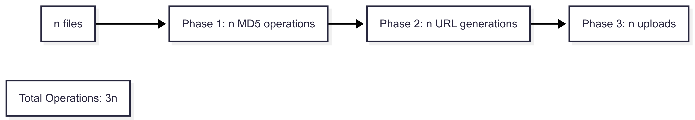
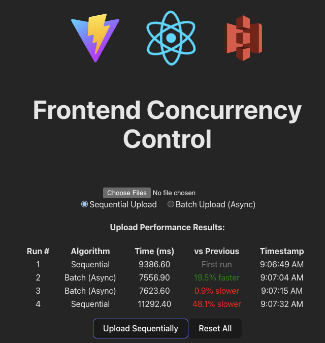
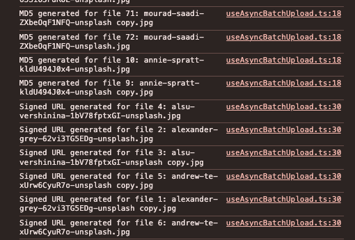
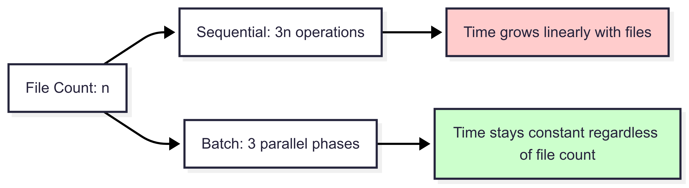
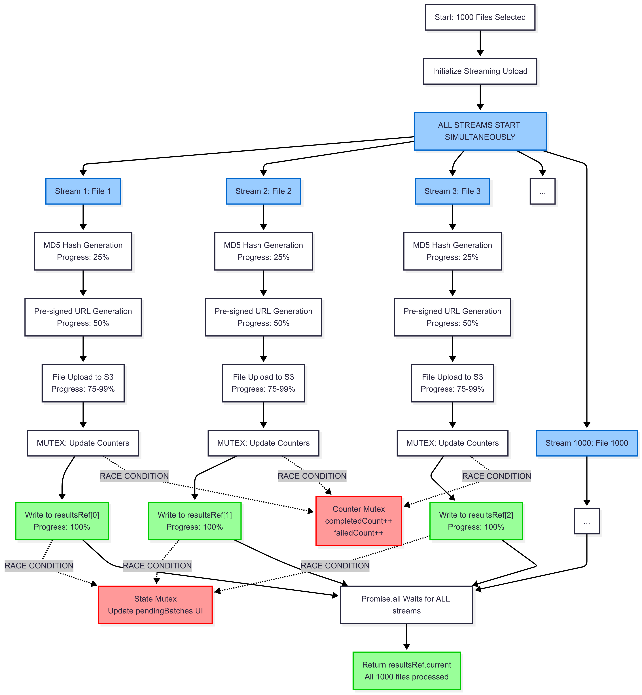
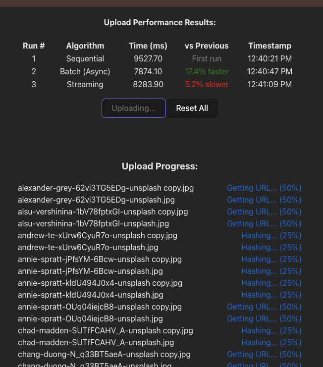

# Frontend Concurrency Control

> Raw Portuguese version is here:

Hello there! Hope you're doing well.

The purpose of Tech Pills here is to begin a series of articles to solve or discuss technical problems we encounter with clients on a daily basis.

Yes, we know that JavaScript essentially works with single-thread execution, relying on callbacks for asynchronous behaviors.

Today we're going to climb a few steps to work with concurrency at different levels.

We're faced with uploading files to storage (Amazon S3 in our case) and how we could improve uploading a large number of files, since the frontend would be responsible for these requests in our initial scenario.

There are N ways to do this today. We'll start with sequential and climb two steps of complexity and performance.

This is the guide project we'll use. Any information related to technologies and setup is centralized in it, but the most important thing now is to understand the concepts and what problem we want to solve REPLACEME

We'll simulate an S3 server locally with [localstack](https://github.com/localstack/localstack), but that doesn't matter. For a real case, we just need to make the necessary edits to our client, because we'll consume the same AWS S3 SDK.

You'll notice that our s3-client also normally uses the AWS S3 SDKs, following Amazon's own documentation https://docs.aws.amazon.com/AmazonS3/latest/userguide/upload-objects.html

We also know that we need an `S3Client` with our specific configurations, and for our case we'll also use [pre-signed URLs](https://docs.aws.amazon.com/AmazonS3/latest/userguide/using-presigned-url.html)

As already mentioned, the implementation of the methods is not trivial and is in the repository for reference (whenever we have ... ellipses it means I've hidden the implementation).

```ts
// src/infra/S3Client.ts

class LocalS3Simulator {
  readonly client: S3Client;
  readonly bucket: string;
  readonly baseUrl: string;

  constructor(options: LocalS3SimulatorOptions = {}) {
    this.client = new S3Client({
      region: options.region || "us-east-1",
      endpoint: options.endpoint || "http://localhost:4566",
      forcePathStyle: true,
      credentials: {
        accessKeyId: options.accessKeyId || "test",
        secretAccessKey: options.secretAccessKey || "test",
      },
    });

    this.bucket = options.bucket || "test-uploads";
    this.baseUrl = options.endpoint || "http://localhost:4566";
  }

  async bucketExists(): Promise<boolean> {/* ... */}
  async createBucket(): Promise<CreateBucketCommandOutput | undefined> {/* ... */}
  async generateSignedUploadUrl(fileName: string): Promise<string> {/* ... */}
}
```

For this case we'll also check the [integrity](https://docs.aws.amazon.com/AmazonS3/latest/userguide/checking-object-integrity.html) of our upload by providing an [MD5](https://docs.aws.amazon.com/pt_br/redshift/latest/dg/r_MD5.html) hash, and with that we can finally begin our journey in sending files.

## Sequential

> Implementation of this step here https://github.com/Tech-Pills/frontend-concurrency-control/pull/1

In our initial approach, sequentially, we'll create MD5 hashes, temporary links, and then perform the uploads.

An important point is that the frontend implementation and its components are trivial. We'll focus more on the part that concerns the upload.

So, as mentioned above, we'll follow three steps:
1 - Generate MD5 hashes
2 - Generate pre-signed URLs
3 - Perform uploads

And for each of them, we'll do it sequentially. In this scenario we'll send 1,000 files at a time.
Notice that we only start generating pre-signed URLs when we have all the hashes, and we also only start uploads when we have all the pre-signed URLs.

We'll have this class responsible for generating pre-signed URLs and making a simple fetch for the upload:

```ts
// infra/S3UploadService.ts
export class S3UploadService {
  private s3Client: LocalS3Simulator;

  constructor(bucket = "test-uploads") {
    this.s3Client = new LocalS3Simulator({ bucket });
  }

  async generateSignedUploadUrl(fileName: string): Promise<string> {/* ... */}
  async uploadSingleFile(
    customFile: CustomFile,
    signedUrl: string
  ): Promise<Response> {/* ... */}
```

We could indeed do the entire process for each file before calling the next one, but I wanted to highlight the problem of queuing tasks that are dependent in a completely sequential manner, and often we let this happen when iterating through lists to execute some processing.
Since each iteration is responsible for processing, it will be simple to modify in the next steps. So in this way, our user will only be able to observe their uploads when all hashes and pre-signed URLs have been generated.


We'll have a use case for each of the types I'll show here. Remember not to focus too much on writing decisions, some were designed to better exemplify the phases we'll go through.

```ts
// useCases/useSequentialUpload.ts

export const useSequentialUpload = () => {
  const [uploadService] = useState(() => new S3UploadService());
  /* ... */

async function uploadFilesSequentially(files: File[]): Promise<Response[]> {
    const results: Response[] = [];
    const customFiles: CustomFile[] = [];

    for (const file of files) {
      const md5Hash = await generateMD5Base64(file);
      customFiles.push({ file, md5: md5Hash, preSignedUrl: "" });
    }

    for (const customFile of customFiles) {
      const signedUrl = await uploadService.generateSignedUploadUrl(
        customFile.file.name
      );
      customFile.preSignedUrl = signedUrl;
    }

    for (const customFile of customFiles) {
      const result = await uploadService.uploadSingleFile(
        customFile,
        customFile.preSignedUrl
      );
      results.push(result);
    }

    return results;
  }
}
```

At this moment we can observe a time complexity of `O(3n)`. The 3 is disposable, but for our understanding, illustrating it is important because it becomes evident that for each phase we have here, we have potential to work in parallel.



To be honest, if we were thinking that our user is waiting for the upload and would like some feedback, we could have structured so that all steps are executed within a "wrapper" so that we don't need to wait for all hashes and pre-signed URLs to be created before starting the first upload. We would make a batch handle the 3 processes and create a queue for that. I forced this decision for a study scenario, for this and the next example.

If you happen to be using my repository as a base, you can check the uploaded files at `http://localhost:4566/test-uploads/`

## Async Batch

> Implementation of this step here https://github.com/Tech-Pills/frontend-concurrency-control/pull/2

Now in each of the phases we use [Promises](https://developer.mozilla.org/en-US/docs/Web/JavaScript/Reference/Global_Objects/Promise), therefore each action can happen at the same time as another, and as soon as they all resolve we can move to the next step in our flow. It's still necessary to wait for all hash generations to happen, for example, but now no longer sequentially.

We add a new use case for our asynchronous batch upload:

```ts
// useCases/useAsyncBatchUpload.ts
export const useBatchUpload = () => {
  // ...
    async function uploadFilesBatch(files: File[]): Promise<Response[]> {
    const results: Response[] = [];
    const customFiles: CustomFile[] = [];

    const md5Promises = files.map(async (file, index) => {
      const md5Hash = await generateMD5Base64(file);
      console.log(`MD5 generated for file ${index + 1}: ${file.name}`);
      return { file, md5: md5Hash, preSignedUrl: "" };
    });
    
    const resolvedCustomFiles = await Promise.all(md5Promises);
    customFiles.push(...resolvedCustomFiles);

    const urlPromises = customFiles.map(async (customFile, index) => {
      const signedUrl = await uploadService.generateSignedUploadUrl(
        customFile.file.name
      );
      customFile.preSignedUrl = signedUrl;
      console.log(`Signed URL generated for file ${index + 1}: ${customFile.file.name}`);
    });
    
    await Promise.all(urlPromises);

    const uploadPromises = customFiles.map(async (customFile, index) => {
      console.log(`Uploading file ${index + 1}: ${customFile.file.name}`);
      return await uploadService.uploadSingleFile(
        customFile,
        customFile.preSignedUrl
      );
    });
    
    const uploadResults = await Promise.all(uploadPromises);
    results.push(...uploadResults);

    return results;
  }
  // ...
}
```

I also made some non-trivial modifications to our main UI to have some comparisons between each execution and algorithm.



To further illustrate, now we have multiple people responsible for executing actions at the same time and not just one.

If we were a restaurant, in the sequential form we would have only 1 chef:
- Reading 1 order -> reading 1 order -> reading 1 order 
- Preparing 1 dish -> preparing 1 dish -> preparing 1 dish
- Delivering 1 order -> delivering 1 order -> delivering 1 order


And in the asynchronous batch example, we hire multiple chefs:
- All chefs start reading orders, as soon as the last one finishes
- All chefs start preparing dishes, as soon as the last one finishes
- All chefs deliver orders

I added some logs to show that some actions within each phase can happen before another.



Since everything happens in parallel in each phase, our algorithm now drops to `O(phases)`. In this case we have 3 phases happening.



Keep in mind that performance is not as expected if we count the complexity achieved, but we have some bottlenecks happening at various points:
- Browser connection limits;
- LocalStack limits some resources;
- Single Nginx proxy saturating our connection;
- Limits in JavaScript's [event loop](https://nodejs.org/id/learn/asynchronous-work/event-loop-timers-and-nexttick#what-is-the-event-loop). 

That's why overall we only achieve about ~20% performance improvement.


I don't want to go deep into the concept of [Threads](https://developer.mozilla.org/en-US/docs/Glossary/Thread), but we know that JavaScript was initially designed as single-threaded executing one operation at a time, but today we know it's possible to create additional threads.

## Streaming + Mutex

> Implementation of this step here https://github.com/Tech-Pills/frontend-concurrency-control/pull/3

Finally, we're going to start working with pipeline processing. As mentioned earlier, each phase of our processing needs the previous one, but we don't need all actions of one phase to finish before starting the next.

Following the restaurant example with multiple chefs, we agreed that in the previous scenario the chefs could only work on the next step when ALL others had finished, but now:
- All chefs start reading orders, as soon as each chef finishes
- Each chef can start preparing their dish as soon as each chef finishes
- Each chef can deliver their order

```ts
export const useStreamingUpload = () => {
// ...
  async function uploadFilesStreaming(files: File[]): Promise<Response[]> {
    const results: Response[] = new Array(files.length);
    
    const processFile = async (file: File, index: number) => {
      try {
        const md5Hash = await generateMD5Base64(file);
        const signedUrl = await uploadService.generateSignedUploadUrl(file.name);
        
        const customFile: CustomFile = {
          file,
          md5: md5Hash,
          preSignedUrl: signedUrl
        };
        
        const result = await uploadService.uploadSingleFile(customFile, signedUrl);
        results[index] = result;
        
        return result;
      } catch (error) {
        const failedResponse = new Response(null, { 
          status: 500, 
          statusText: error instanceof Error ? error.message : 'Unknown error' 
        });
        
        results[index] = failedResponse;
        return failedResponse;
      }
    };
    const streamPromises = files.map((file, index) => processFile(file, index));
    await Promise.all(streamPromises);
    return results;
  }
  // ...
}
```

Can you identify any problems? Some of these actions may compete for resources, for example, trying to access our `results` at the same time, having errors interfering with processes still running, and also not having any visibility of the state of each pending batch execution. But remember, as we've already discussed, JavaScript is single-threaded and we're not creating other threads at the moment, so many scenarios that seem to compete for resources may not even exist. But regardless, we'll proceed to solve the "problem".

When we compete for resources, we fall into a [race condition](https://en.wikipedia.org/wiki/Race_condition), but we have something that solves this problem: the [Mutex - mutual exclusion](https://pt.wikipedia.org/wiki/Exclus%C3%A3o_m%C3%BAtua), which blocks access to some public resource, avoiding unexpected behaviors.

We'll use [useRef](https://react.dev/reference/react/useRef) to create references where necessary and [async-mutex](https://github.com/DirtyHairy/async-mutex), the library that today provides the most stability for this type of implementation in JavaScript.

Let's break down the explanation into parts:
```ts
// useCases/useStreamingUpload.ts
export const useStreamingUpload = () => {
  const completedCountRef = useRef(0);
  const failedCountRef = useRef(0);
  const counterMutex = useRef(new Mutex()).current;

  const resultsRef = useRef<Response[]>([]);
  const [fileProgress, setFileProgress] = useState<FileProgress[]>([]);
  const stateMutex = useRef(new Mutex()).current;
  // ...
}
```

We now have a reference to count actions that completed or failed and a `Mutex` to control access to them, also references for results and what's still pending, controlled by another `Mutex`.

The `useRef(new Mutex()).current` pattern is an optimization that ensures a unique and persistent mutex instance across all component re-renders:
1. `useRef()` creates persistent storage - The ref object survives new renders
2. `.current` extracts the mutex immediately - No need to access .current everywhere
3. Single initialization - The Mutex constructor runs only once during the first render.

In addition to initializing each context, when we need to update our pending batches, `stateMutex.runExclusive` will protect its mutual access.
```ts
// useCases/useStreamingUpload.ts
// ...
async function uploadFilesStreaming(files: File[]): Promise<Response[]> {
  completedCountRef.current = 0;
  failedCountRef.current = 0;
  resultsRef.current = new Array(files.length);
  
  const initialProgress: FileProgress[] = files.map((file, index) => ({
    id: index,
    fileName: file.name,
    phase: 'waiting',
    progress: 0,
    startTime: performance.now()
  }));
  
  setFileProgress(initialProgress);
  
  const updateFileProgress = async (index: number, phase: FileProgress['phase'], progress?: number) => {
    await stateMutex.runExclusive(async () => {
      setFileProgress(prev => prev.map((file, i) => 
        i === index ? { ...file, phase, progress: progress ?? file.progress } : file
      ));
    });
  };
// ...
```

And for writing results as well:
```ts
// useCases/useStreamingUpload.ts
// ...
const setResult = async (index: number, result: Response) => {
  resultsRef.current[index] = result;

  await counterMutex.runExclusive(async () => {
    if (result.ok) {
      completedCountRef.current += 1;
      console.log(
        `MUTEX ACCESS: Incremented completed count to ${completedCountRef.current}`
      );
    } else {
      failedCountRef.current += 1;
      console.log(
        `MUTEX ACCESS: Incremented failed count to ${failedCountRef.current}`
      );
    }
  });

  await updateFileProgress(
    index,
    result.ok ? "completed" : "failed",
    result.ok ? 100 : 0
  );
};
// ...
```

And for the file processing itself, we have the call to each phase with its state update immediately after, each ensuring safe access for accesses and updates (I decided to use fixed values for progress updates just so we can analyze this in the simplest possible way).
```ts
// useCases/useStreamingUpload.ts
// ...
const processFile = async (file: File, index: number) => {
  try {
    console.log(
      `Starting streaming process for file ${index + 1}: ${file.name}`
    );

    await updateFileProgress(index, "md5", 25);
    console.log(
      `Phase 1 - MD5 generation for file ${index + 1}: ${file.name}`
    );
    const md5Hash = await generateMD5Base64(file);

    await updateFileProgress(index, "url", 50);
    console.log(
      `Phase 2 - URL generation for file ${index + 1}: ${file.name}`
    );

    const signedUrl = await uploadService.generateSignedUploadUrl(
      file.name
    );

    await updateFileProgress(index, "upload", 75);
    console.log(
      `Phase 3 - Upload starting for file ${index + 1}: ${file.name}`
    );
    const customFile: CustomFile = {
      file,
      md5: md5Hash,
      preSignedUrl: signedUrl,
    };

    const result = await uploadService.uploadSingleFile(
      customFile,
      signedUrl
    );

    await setResult(index, result);

    console.log(
      `Streaming upload completed for file ${index + 1}: ${file.name}`
    );
    return result;
// ...
```
These are the main changes. As mentioned, in addition to ensuring safe accesses/updates, we also initialize all streams at the same time and they can "compete" for these resources.



You must have noticed that we didn't gain performance, but now we process each upload as soon as the other steps have finished, getting closer to what we expect from a real-world implementation, delivering more speed and experience to the user.

Time complexity `O(1)`?
Constant time, regardless of file count, because:
- All streams start at t=0 simultaneously;
- Each file processes independently through its pipeline;
- No waiting for other files to complete phases;
- Total time = time to process the slowest individual file

But like the other example, all the resource limitations already mentioned and performance will be similar in our local context to the previous implementation (in terms of speed for completing all files).

We updated the UI to observe how each phase is now happening at different moments:



It's also important to note that we went through several types of implementations and used file upload as an example, but all the concepts used here can be applied in any other context with bananas or apples.

For a next article, we'll talk about this same implementation with Web Workers and Multi-threading.

See you on GitHub, see you soon! :rocket:
