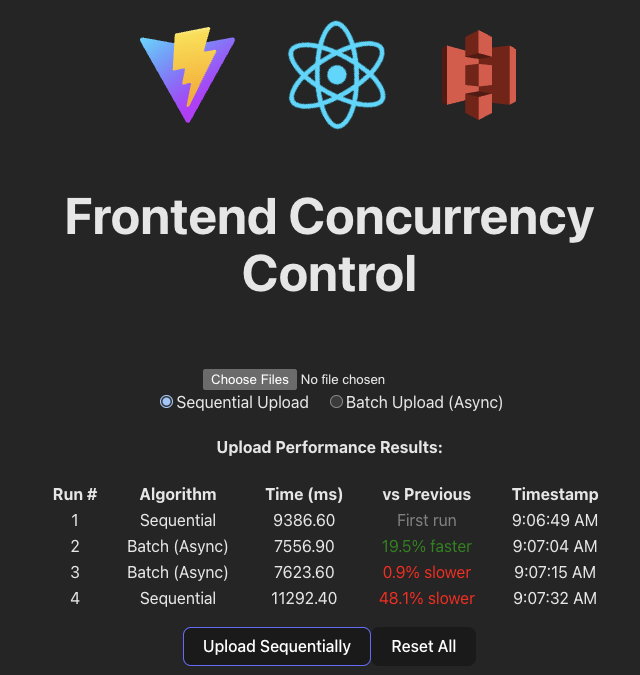
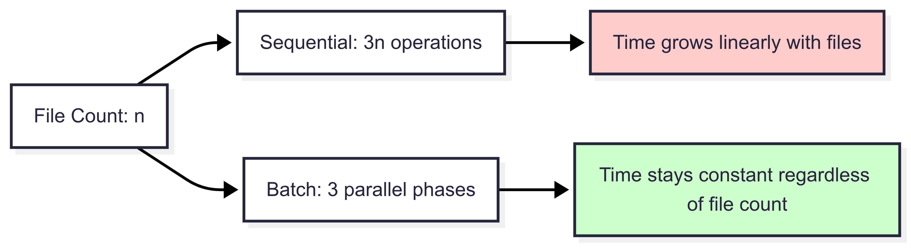
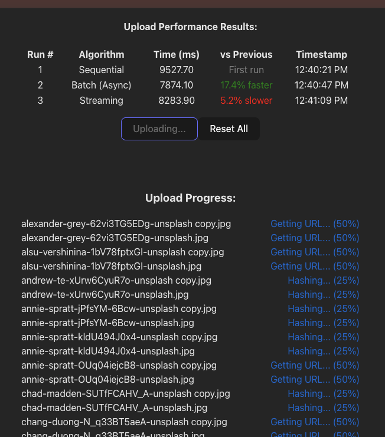

# Frontend Concurrency Control


> LLM improved English version is here: REPLACEME

Fala, turma! Espero que esteja tudo bem.

O intuito do Tech Pills aqui é começar com uma série de artigos para resolver ou discutir problemas técnicos que encontramos nos clientes no dia a dia.

Sim, nós sabemos que o JavaScript, em suma, trabalha com execução single thread, dependendo de callbacks para comportamentos assíncronos.

Hoje vamos subir algumas escadas para trabalharmos com concorrência em alguns níveis.

Nos deparamos com um upload de arquivos para um storage (Amazon S3 no nosso caso) e como poderíamos melhorar o upload de uma quantidade grande de arquivos, já que o frontend seria responsável por essas requests para o nosso cenário inicial.

Temos N maneiras de fazer isso hoje, começaremos pela sequencial e subiremos duas escadas de complexidade e também de performance.

Esse é o projeto guia que usaremos, qualquer informação relacionada às tecnologias e setup estão centralizadas nele, mas o mais importante agora é entendermos os conceitos e qual problema queremos resolver.

Iremos simular um servidor S3 localmente com [localstack](https://github.com/localstack/localstack), mas isso não importa, para um caso real é só fazermos as edições necessárias no nosso client, porque iremos consumir a mesma SDK da aws-s3.

Vai perceber que o nosso s3-client também utiliza normalmente os SDKs da aws-s3
Seguindo a própria documentação da Amazon https://docs.aws.amazon.com/AmazonS3/latest/userguide/upload-objects.html

Também sabemos que precisamos de um `S3Client` com nossas configurações específicas e para o nosso caso também iremos usar [URLs pré-assinadas](https://docs.aws.amazon.com/AmazonS3/latest/userguide/using-presigned-url.html)

Como já dito, a implementação dos métodos não são triviais e estão no repositório para consulta (sempre que tivermos ... reticências quer dizer que eu escondi a implementação).

```ts
// src/infra/S3Client.ts

class LocalS3Simulator {
  readonly client: S3Client;
  readonly bucket: string;
  readonly baseUrl: string;

  constructor(options: LocalS3SimulatorOptions = {}) {
    this.client = new S3Client({
      region: options.region || "us-east-1",
      endpoint: options.endpoint || "http://localhost:4566",
      forcePathStyle: true,
      credentials: {
        accessKeyId: options.accessKeyId || "test",
        secretAccessKey: options.secretAccessKey || "test",
      },
    });

    this.bucket = options.bucket || "test-uploads";
    this.baseUrl = options.endpoint || "http://localhost:4566";
  }

  async bucketExists(): Promise<boolean> {/* ... */}
  async createBucket(): Promise<CreateBucketCommandOutput | undefined> {/* ... */}
  async generateSignedUploadUrl(fileName: string): Promise<string> {/* ... */}
}
```

Para esse caso também vamos checar a [integridade](https://docs.aws.amazon.com/AmazonS3/latest/userguide/checking-object-integrity.html) do nosso upload provendo uma [MD5](https://docs.aws.amazon.com/pt_br/redshift/latest/dg/r_MD5.html) e com isso poderemos finalmente começar nossa jornada no envio dos arquivos.

## Sequencial

> Implementação dessa etapa aqui https://github.com/Tech-Pills/frontend-concurrency-control/pull/1

Na nossa forma inicial, de maneira sequencial, iremos criar as hashes MD5, os links temporários e então faremos os uploads.

Um ponto importante é que a implementação frontend e seus componentes é trivial, vamos focar mais na parte que tange o upload.

Então, como citado acima, vamos seguir três passos:
1 - Gerar os MD5 hashes
2 - Gerar as URLs pré-assinadas
3 - Fazer os uploads

E para cada um deles, vamos fazer de forma sequencial. Nesse cenário vamos enviar 1.000 (MIL) arquivos por vez.
Veja que só começamos a gerar as URLs pré-assinadas quando temos todas as hashes, e também só começamos os uploads quando tivermos todas as URLs pré-assinadas.

Teremos essa classe responsável por gerar as URLs pré-assinadas e fazer um fetch simples para o upload

```ts
// infra/S3UploadService.ts
export class S3UploadService {
  private s3Client: LocalS3Simulator;

  constructor(bucket = "test-uploads") {
    this.s3Client = new LocalS3Simulator({ bucket });
  }

  async generateSignedUploadUrl(fileName: string): Promise<string> {/* ... */}
  async uploadSingleFile(
    customFile: CustomFile,
    signedUrl: string
  ): Promise<Response> {/* ... */}
```

Poderíamos sim fazer o processo todo para cada arquivo antes de chamar o próximo, mas queria evidenciar o problema em enfileirarmos tarefas que são dependentes de forma totalmente sequencial, e muitas vezes deixamos isso acontecer ao iterar por listas para executarmos algum processamento.
Como cada iteração é responsável por um processamento, deixará simples de modificarmos nos próximos passos, então dessa forma, nosso usuário só vai conseguir observar os seus uploads quando todos os hashes e URLs pré-assinadas forem geradas.


Teremos um caso de uso para cada um dos tipos que vou mostrar aqui, lembrando para não se ater muito às decisões de escrita, algumas foram pensadas para exemplificar melhor pelas fases que vamos passar.

```ts
// useCases/useSequentialUpload.ts

export const useSequentialUpload = () => {
  const [uploadService] = useState(() => new S3UploadService());
  /* ... */

async function uploadFilesSequentially(files: File[]): Promise<Response[]> {
    const results: Response[] = [];
    const customFiles: CustomFile[] = [];

    for (const file of files) {
      const md5Hash = await generateMD5Base64(file);
      customFiles.push({ file, md5: md5Hash, preSignedUrl: "" });
    }

    for (const customFile of customFiles) {
      const signedUrl = await uploadService.generateSignedUploadUrl(
        customFile.file.name
      );
      customFile.preSignedUrl = signedUrl;
    }

    for (const customFile of customFiles) {
      const result = await uploadService.uploadSingleFile(
        customFile,
        customFile.preSignedUrl
      );
      results.push(result);
    }

    return results;
  }
}
```

Nesse momento podemos observar uma complexidade no tempo um `O(3n)`, o 3 é descartável mas para o nosso entendimento ilustrá-lo é importante, porque fica evidente que para cada fase que teríamos aqui, temos potencial para trabalharmos em paralelo.


Para ser honesto, se estivéssemos pensando que o nosso usuário está esperando pelo upload e gostaria de algum feedback, poderíamos ter estruturado para que todos os passos sejam executados dentro de um "embrulho" para que não precisemos esperar todas as hashes e URLs pré-assinadas serem criadas para então iniciarmos o primeiro upload, faríamos um batch cuidar dos 3 processos e faríamos uma fila disso, forcei essa decisão para um cenário de estudo, para esse e o próximo exemplo.

Se por acaso está usando meu repositório como base você pode checar os arquivos enviados em `http://localhost:4566/test-uploads/`

## Async Batch

> Implementação dessa etapa aqui https://github.com/Tech-Pills/frontend-concurrency-control/pull/2

Agora em cada uma das fases nós usamos [Promises](https://developer.mozilla.org/en-US/docs/Web/JavaScript/Reference/Global_Objects/Promise), portanto cada ação pode acontecer ao mesmo tempo que outra e assim que todas elas resolverem podemos passar para a próxima etapa no nosso fluxo, ainda sendo necessário esperar por todas as gerações de hashes acontecerem, por exemplo, mas agora não mais de forma sequencial.

Adicionamos um novo caso de uso para o nosso upload em batches assíncronos

```ts
// useCases/useAsyncBatchUpload.ts
export const useBatchUpload = () => {
  // ...
    async function uploadFilesBatch(files: File[]): Promise<Response[]> {
    const results: Response[] = [];
    const customFiles: CustomFile[] = [];

    const md5Promises = files.map(async (file, index) => {
      const md5Hash = await generateMD5Base64(file);
      console.log(`MD5 generated for file ${index + 1}: ${file.name}`);
      return { file, md5: md5Hash, preSignedUrl: "" };
    });
    
    const resolvedCustomFiles = await Promise.all(md5Promises);
    customFiles.push(...resolvedCustomFiles);

    const urlPromises = customFiles.map(async (customFile, index) => {
      const signedUrl = await uploadService.generateSignedUploadUrl(
        customFile.file.name
      );
      customFile.preSignedUrl = signedUrl;
      console.log(`Signed URL generated for file ${index + 1}: ${customFile.file.name}`);
    });
    
    await Promise.all(urlPromises);

    const uploadPromises = customFiles.map(async (customFile, index) => {
      console.log(`Uploading file ${index + 1}: ${customFile.file.name}`);
      return await uploadService.uploadSingleFile(
        customFile,
        customFile.preSignedUrl
      );
    });
    
    const uploadResults = await Promise.all(uploadPromises);
    results.push(...uploadResults);

    return results;
  }
  // ...
}
```

Também fiz algumas modificações não triviais à nossa UI principal para termos algumas comparações entre cada execução e algoritmo.



Exemplificando mais ainda, agora temos vários responsáveis por executar as ações ao mesmo tempo e não apenas um.

Se fôssemos um restaurante, na forma sequencial teríamos apenas 1 chef:
- Leitura de 1 pedido -> leitura de 1 pedido -> leitura de 1 pedido 
- Preparo de 1 prato -> preparo de 1 prato -> preparo de 1 prato
- Entrega de 1 pedido -> entrega de 1 pedido -> entrega de 1 pedido


E no exemplo de batches assíncronos, contratamos vários chefs:
- Todos os chefs começam a leitura dos pedidos, assim que o último termina
- Todos os chefs começam o preparo dos pratos, assim que o último termina
- Todos os chefs entregam os pedidos

Adicionei alguns logs para evidenciar que algumas ações dentro de cada fase podem acontecer antes de outra.


Como em cada fase tudo acontece em paralelo agora o nosso algoritmo cai para `O(fases)` nesse caso temos 3 etapas acontecendo.



Tenha em mente que a performance não é a esperada se contarmos a complexidade atingida mas temos alguns gargalos acontecendo em diversos pontos:
- Limite de conexões do browser;
- LocalStack limita alguns recursos;
- Único Nginx proxy saturando a nossa conexão;
- Limites no [event loop](https://nodejs.org/id/learn/asynchronous-work/event-loop-timers-and-nexttick#what-is-the-event-loop) do JavaScript. 

Por isso no geral obtemos apenas cerca de ~20% de performance.


Eu não quero ir a fundo no conceito de [Threads](https://developer.mozilla.org/en-US/docs/Glossary/Thread) mas sabemos que o JavaScript foi desenhado inicialmente como single thread executando uma operação por vez, mas hoje sabemos que é possível criar threads adicionais

## Streaming + Mutex

> Implementação dessa etapa aqui https://github.com/Tech-Pills/frontend-concurrency-control/pull/3

Finalmente vamos começar a trabalhar com processamento em fila, como citado anteriormente, cada fase do nosso processamento precisa da anterior, mas não precisamos que todas as ações de uma fase terminem para começarmos a próxima.

Seguindo o exemplo do restaurante com vários chefs, concordamos que no cenário anterior os chefs só podiam trabalhar na próxima etapa quando TODOS os outros tinham terminado, mas agora:
- Todos os chefs começam a leitura dos pedidos, assim que cada chef termina
- Cada chef pode começar o preparo do seu prato, assim que cada chef termina
- Cada chef pode entregar o seu pedido

```ts
export const useStreamingUpload = () => {
// ...
  async function uploadFilesStreaming(files: File[]): Promise<Response[]> {
    const results: Response[] = new Array(files.length);
    
    const processFile = async (file: File, index: number) => {
      try {
        const md5Hash = await generateMD5Base64(file);
        const signedUrl = await uploadService.generateSignedUploadUrl(file.name);
        
        const customFile: CustomFile = {
          file,
          md5: md5Hash,
          preSignedUrl: signedUrl
        };
        
        const result = await uploadService.uploadSingleFile(customFile, signedUrl);
        results[index] = result;
        
        return result;
      } catch (error) {
        const failedResponse = new Response(null, { 
          status: 500, 
          statusText: error instanceof Error ? error.message : 'Unknown error' 
        });
        
        results[index] = failedResponse;
        return failedResponse;
      }
    };
    const streamPromises = files.map((file, index) => processFile(file, index));
    await Promise.all(streamPromises);
    return results;
  }
  // ...
}
```

Consegue identificar algum problema? Algumas dessas ações podem concorrer por recursos, por exemplo, tentar acessar o nosso `results` ao mesmo tempo, termos erros interferindo em processos ainda em execução e também não termos nenhuma visibilidade do estado de cada execução em lote pendente, mas lembrando que como já conversamos o JavaScript é single-threaded e não estamos criando outras threads no momento, então muitos cenários que parecem competir por recursos podem nem existir, mas independente disso, seguiremos para resolver o "problema".
Quando disputamos por recursos, caímos em uma [race condition](https://en.wikipedia.org/wiki/Race_condition), mas temos algo que resolve esse problema, o [Mutex - mutual exclusion](https://pt.wikipedia.org/wiki/Exclus%C3%A3o_m%C3%BAtua), que dessa forma bloqueamos o acesso de algum recurso público, evitando comportamentos inesperados.

Vamos usar [useRef](https://react.dev/reference/react/useRef) para criarmos referências onde é necessário e o [async-mutex](https://github.com/DirtyHairy/async-mutex) a biblioteca que hoje entrega mais estabilidade nesse tipo de implementação para JavaScript.

Vamos quebrar a explicação em algumas partes:
```ts
// useCases/useStreamingUpload.ts
export const useStreamingUpload = () => {
  const completedCountRef = useRef(0);
  const failedCountRef = useRef(0);
  const counterMutex = useRef(new Mutex()).current;

  const resultsRef = useRef<Response[]>([]);
  const [fileProgress, setFileProgress] = useState<FileProgress[]>([]);
  const stateMutex = useRef(new Mutex()).current;
  // ...
}
```

Temos agora uma referência para contarmos as ações que completaram ou falharam e um `Mutex` para fazermos o controle do acesso a elas, também referências para os resultados e o que ainda está pendente, sendo controlados por um outro `Mutex`.

O padrão `useRef(new Mutex()).current` é uma otimização que garante uma instância única e persistente de mutex em todas as re-renderizações de componentes:
1. `useRef()` cria armazenamento persistente - O objeto ref sobrevive a novas renderizações
2. `.current` extrai o mutex imediatamente - Não há necessidade de acessar .current em todos os lugares
3. Inicialização única - O construtor Mutex é executado apenas uma vez durante a primeira renderização.

Além de iniciarmos cada contexto, quando precisarmos atualizar as nossas pending batches o `stateMutex.runExclusive` vai proteger o seu acesso mútuo.
```ts
// useCases/useStreamingUpload.ts
// ...
async function uploadFilesStreaming(files: File[]): Promise<Response[]> {
  completedCountRef.current = 0;
  failedCountRef.current = 0;
  resultsRef.current = new Array(files.length);
  
  const initialProgress: FileProgress[] = files.map((file, index) => ({
    id: index,
    fileName: file.name,
    phase: 'waiting',
    progress: 0,
    startTime: performance.now()
  }));
  
  setFileProgress(initialProgress);
  
  const updateFileProgress = async (index: number, phase: FileProgress['phase'], progress?: number) => {
    await stateMutex.runExclusive(async () => {
      setFileProgress(prev => prev.map((file, i) => 
        i === index ? { ...file, phase, progress: progress ?? file.progress } : file
      ));
    });
  };
// ...
```

E para a escrita dos resultados também:
```ts
// useCases/useStreamingUpload.ts
// ...
const setResult = async (index: number, result: Response) => {
  resultsRef.current[index] = result;

  await counterMutex.runExclusive(async () => {
    if (result.ok) {
      completedCountRef.current += 1;
      console.log(
        `MUTEX ACCESS: Incremented completed count to ${completedCountRef.current}`
      );
    } else {
      failedCountRef.current += 1;
      console.log(
        `MUTEX ACCESS: Incremented failed count to ${failedCountRef.current}`
      );
    }
  });

  await updateFileProgress(
    index,
    result.ok ? "completed" : "failed",
    result.ok ? 100 : 0
  );
};
// ...
```

E para o processamento do arquivo em si, temos a chamada de cada uma das fases com a atualização do seu estado logo em sequência, e cada um deles garantindo o acesso de forma segura para os acessos e atualizações (decidi usar valores fixos para a atualização do progresso só para podermos analisar isso da forma mais simples possível).
```ts
// useCases/useStreamingUpload.ts
// ...
const processFile = async (file: File, index: number) => {
  try {
    console.log(
      `Starting streaming process for file ${index + 1}: ${file.name}`
    );

    await updateFileProgress(index, "md5", 25);
    console.log(
      `Phase 1 - MD5 generation for file ${index + 1}: ${file.name}`
    );
    const md5Hash = await generateMD5Base64(file);

    await updateFileProgress(index, "url", 50);
    console.log(
      `Phase 2 - URL generation for file ${index + 1}: ${file.name}`
    );

    const signedUrl = await uploadService.generateSignedUploadUrl(
      file.name
    );

    await updateFileProgress(index, "upload", 75);
    console.log(
      `Phase 3 - Upload starting for file ${index + 1}: ${file.name}`
    );
    const customFile: CustomFile = {
      file,
      md5: md5Hash,
      preSignedUrl: signedUrl,
    };

    const result = await uploadService.uploadSingleFile(
      customFile,
      signedUrl
    );

    await setResult(index, result);

    console.log(
      `Streaming upload completed for file ${index + 1}: ${file.name}`
    );
    return result;
// ...
```
Essas são as principais mudanças, como dito, além de garantirmos os acessos/atualizações de forma segura, também inicializamos todas as streams ao mesmo tempo e elas poderão "brigar" por esses recursos.


Você deve ter percebido que não ganhamos em performance, mas agora processamos cada upload assim que as outras etapas já finalizaram, chegando mais próximo do que esperamos de uma implementação na vida real, entregando mais velocidade e experiência para o usuário.

Complexidade de tempo `O(1)`?
Tempo constante, independentemente da contagem de arquivos, porque:
- Todos os fluxos começam em t=0 simultaneamente;
- Cada arquivo processa independentemente por meio de seu pipeline;
- Sem espera para que outros arquivos concluam fases;
- Tempo total = tempo para processar o arquivo individual mais lento

Mas como no outro exemplo todas as limitações de recurso já citadas e a performance vai se assemelhar no nosso contexto rodando local à implementação anterior (em tempos de velocidade para conclusão de todos os arquivos).

Atualizamos a UI para observamos como cada fase agora está acontecendo em um momento:



Também é importante notar que passamos por alguns tipos de implementações e usamos o file upload como exemplo, mas todos os conceitos utilizados aqui podem ser aplicados em qualquer outro contexto com bananas ou maçãs.

Para um próximo artigo, vamos falar dessa mesma implementação com Web Workers e Multi-threading.

Nos vemos no github, até breve! :rocket:
